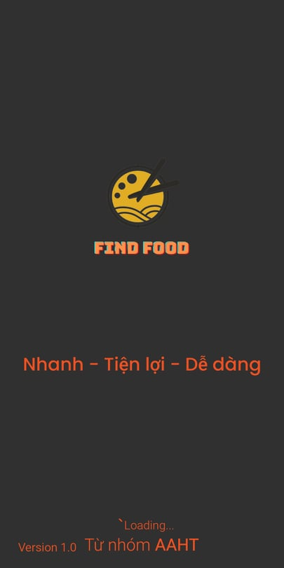
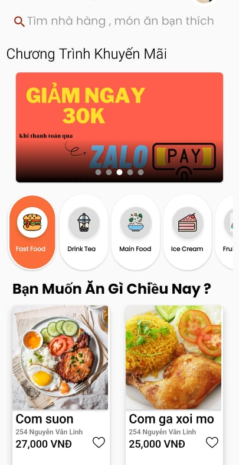
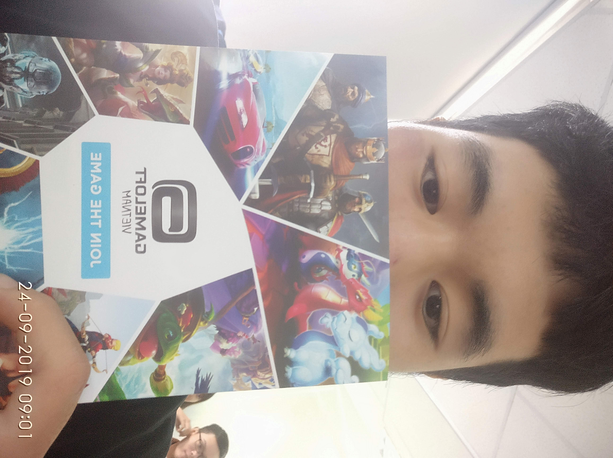
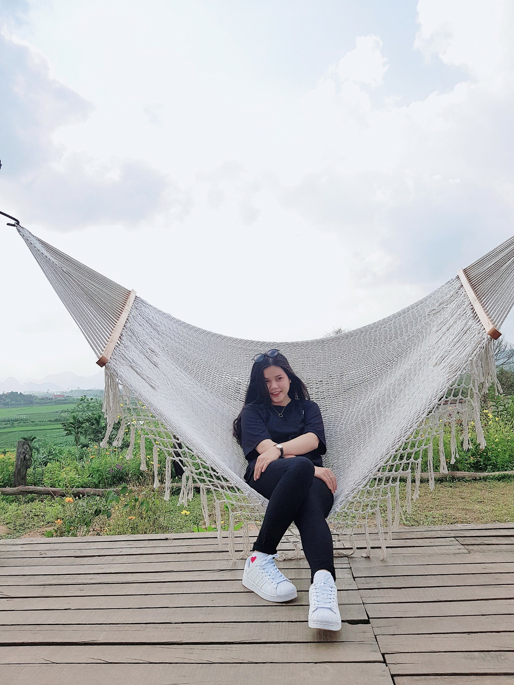

# FoodStore

## Date: Feb 2021 - Jun 2021

### Introduction

- FoodStore is a application use to help many people can sell food and drink during the epidemic season
- All data is Real Time Database



### Context Diagram:



### Folder Structure:

```
/FoodStore:
  /app
  /gradle
```

- `FoodStore`: include all the project's source code, divided into each module
- `app`: source code of Application
- `gradle`: source code of setting gradle

## Members:

| Avatar                                                   | Name                | Role                                                          | Contact                    |
| -------------------------------------------------------- | ------------------- | ------------------------------------------------------------- | -------------------------- |
| | Bui Duc Thien       | **Team Leader**, Fullstack Developer                          | buiducthien.dtu@gmail.com  |
|    | Phan Thị Việt Hà    | Front-end, UI/UX Design, Android                              | bely052@gmail.com          |
|  | Nguyễn Hiếu         | Design database and UI/UI, Tester                             | monsterhieupke@gmail.com   |
|  | Lê Văn Anh          | Tester                                                        | *******************        |


## Contributing:

Contributions are very welcome and wanted.<br>
To submit your custom pull request, please make sure you read our CONTRIBUTING guidelines.

**Before submitting a new pull request, please make sure:**

- You have updated the package.json version and reported your changes into the CHANGELOG file
- make sure you've added the documentation of your changes.
